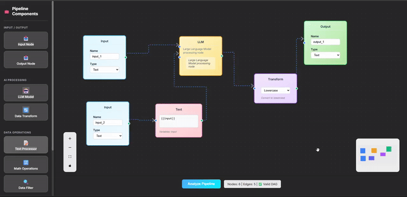
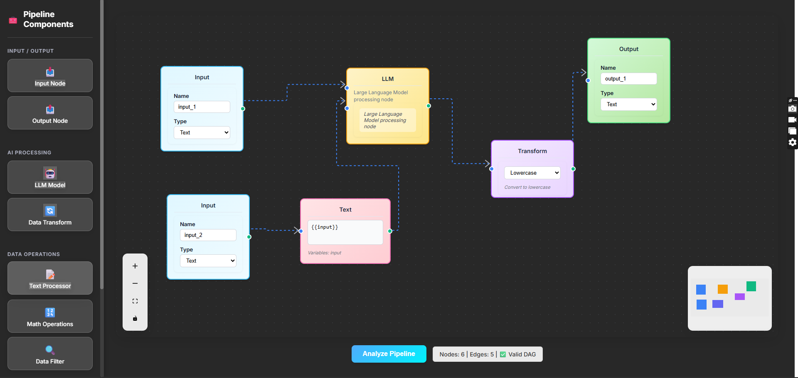

# VectorShift Frontend Technical Assessment

This submission addresses the full scope of the VectorShift frontend technical assessment with a focus on component abstraction, responsive styling, dynamic logic, and backend integration. The implementation leverages modular React components, custom styling, and FastAPI-based validation to create a robust and extensible node-based system.

**Live Demo (GIF):**

---

## 🧩 Node Abstraction

Developed a generalized `BaseNode` component that encapsulates layout, input/output handle logic, and UI structure. This abstraction dramatically reduces code duplication and allows rapid creation of custom nodes.

Five additional node types (`ConditionNode`, `EmailNode`, `TimerNode`, `PromptNode`, `CustomInputNode`) were created using the same base abstraction, demonstrating the pattern's flexibility and scalability.

**Preview:**

---

## 🎨 UI/UX Styling

Introduced a unified design language across the interface, prioritizing visual consistency, responsive layout, and modern UI standards. Nodes, toolbars, and interaction elements follow a cohesive theme, leveraging CSS modules and component-level styling.

---

## ✍️ Advanced Text Node Logic

The `TextNode` component was upgraded with:

- **Auto-resizing**: The node adjusts dynamically to the content entered by the user.
- **Variable detection**: Supports `{{variable}}` syntax, automatically parsing variables and generating corresponding input handles.

These features elevate the text node from a static UI element to a dynamic logic block in the pipeline.

---

## 🔗 Backend Integration

On pipeline submission, the current node and edge data are serialized and sent to a FastAPI `/pipelines/parse` endpoint. The backend processes:

- Total node and edge count
- DAG validation using a topological sort-based check

The frontend parses the backend response and displays a user-friendly alert indicating whether the structure is valid.

**Live Demo (GIF):**

---

## 📹 Full Walkthrough Video

📽️ [Click here to watch the full demo video](https://your-demo-video-link.com)

---

## ✅ Summary

This project reflects production-grade frontend engineering principles:
- Highly reusable component abstraction
- Responsive and consistent UI styling
- Context-aware, dynamic logic
- Fully integrated API feedback loop

All assessment requirements are implemented with clean, maintainable, and extensible code.
